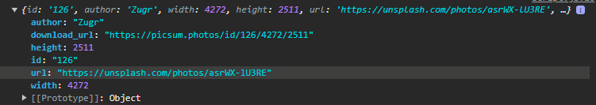

# API (Application Programming Interface)
Una API es un conjunto de funciones y procedimientos que se usan para diseñar e integrar el software de diferentes aplicaciones, permitiendo así que varias aplicaciones se puedan comunicar entre sí, por más que estén desarrolladas de manera completamente diferente. Por ejemplo, existe el API de Twitter, que permite hacer cosas como mostrar tus últimos tweets en un sitio web

En palabras mas sencillas, una API funciona como intermediaria en la comunicación entre dos aplicaciones

Cada una de las APIs que se desarrollen suelen tener un endpoint, es decir una url mediante la cual los clientes o desarrolladores pueden acceder a esa funciones

## API Web y REST
Una API web es permite que diferentes aplicaciones se comuniquen entre sí a través de la web. Las API web permiten que una aplicación solicite datos o acciones a otra aplicación a través de solicitudes HTTP (por lo general utilizando los métodos HTTP como GET, POST, PUT, DELETE).
La forma más comun de implentar una API de este estilo es mediante REST (Representational State Transfer), un tipo de servicio que se caracteriza por lograr interconexiones HTTP con mensajes de tipo XML o JSON.


### Ejemplo y uso de fetch()
<a href="https://picsum.photos">Lorem Picsum</a> es una API que entrega una imagen, cuyas características pueden ser definidas mediante url. La siguiente solicitud, por ejemplo devuelve una imagen al azar de 200x300 píxeles:
```url
https://picsum.photos/200/300
```
También podemos pedirle que nos devuelva no la imagen, sino sus datos, mediante id.
```url
https://picsum.photos/id/0/info
```
Según la documentación, cada imagen tiene los siguientes atributos:
```json
[
    {
        "id":"0",
        "author":"Alejandro Escamilla",
        "width":5000,
        "height":3333,
        "url":"https://unsplash.com/photos/yC-Yzbqy7PY",
        "download_url":"https://picsum.photos/id/0/5000/3333"
    }
]
```
Sabiendo esto, podemos hacer un sitio simple que nos permita mostrar una imagen aleatoria cada vez que reiniciemos la página

Para poder obtener datos de una api en JavaScript existe el comando fetch, el cual proporciona una forma fácil y lógica de obtener recursos. Su estructura es la siguiente
```js
fetch(url)
.then((response) => response.json())  // Convierte los datos a json
.then(data => {  // Crea una nueva funcion, pasando los datos obtenidos como parámetro
    console.log(data)  // (O cualquier código js)
})
```

Entonces, por ejemplo, si pasamos la siguiente url: 'https://picsum.photos/id/0/info', obtenemos todos los datos de la imagen '0'
```js
fetch(`https://picsum.photos/id/0/info`)
    .then((response) => response.json())
    .then(data => {
        console.log(data)
    })
```
Resultado: 


Sabiendo que, mediante el id controlamos la imagen, podemos hacer que se genere un numero aleatorio en el id, mediante, la siguiente funcion
```js
function idRandom(limite) {
  return Math.floor(Math.random() * limite);
}

// Guardamos un numero aleatorio dentro de una variable
let id = idRandom(500)
```

Entonces si reemplazamos el parámetro del id en el fetch por el que generamos, obtendremos siempre datos distintos
```js
function idRandom(limite) {
    return Math.floor(Math.random() * limite);
}

// Guardamos un numero aleatorio dentro de una variable
let id = idRandom(500)

fetch(`https://picsum.photos/id/${id}/info`)
    .then((response) => response.json())
    .then(data => {
        console.log(data)
    })
```

Ahora, adentro de la funcion, podemos usar los datos de data para generar la estructura html de la imagen
```js
function idRandom(limite) {
    return Math.floor(Math.random() * limite);
}

// Guardamos un numero aleatorio dentro de una variable
let id = idRandom(100)

fetch(`https://picsum.photos/id/${id}/info`)
    .then((response) => response.json())
    .then(data => {
        console.log(data)
        // Elementos html
        let imgContainer = document.getElementById("imagenContainer")
        let btnContainer = document.getElementById("btnContainer")
        let img = document.createElement('img')
        let downloadBtn = document.createElement('a')

        // Modificamos el atributo src de la etiqueta img para
        // que sea el de la imagen obtenida
        img.src = `${data.download_url}`
        img.width = 600

        // Características del boton
        downloadBtn.textContent = "Mostrar Original"
        downloadBtn.href = data.download_url
        
        downloadBtn.classList.add('btn', 'btn-primary')

        // Agregamos la imagen al documento
        imgContainer.appendChild(img)
        btnContainer.appendChild(downloadBtn)
    })
```
Código HTML:
```html
<!DOCTYPE html>
<html lang="en">
<head>
    <meta charset="UTF-8">
    <meta name="viewport" content="width=device-width, initial-scale=1.0">
    <link href="https://cdn.jsdelivr.net/npm/bootstrap@5.3.2/dist/css/bootstrap.min.css" rel="stylesheet" integrity="sha384-T3c6CoIi6uLrA9TneNEoa7RxnatzjcDSCmG1MXxSR1GAsXEV/Dwwykc2MPK8M2HN" crossorigin="anonymous">
    <script src="https://cdn.jsdelivr.net/npm/bootstrap@5.3.2/dist/js/bootstrap.bundle.min.js" integrity="sha384-C6RzsynM9kWDrMNeT87bh95OGNyZPhcTNXj1NW7RuBCsyN/o0jlpcV8Qyq46cDfL" crossorigin="anonymous"></script>
    <title>Clase APIs</title>
</head>
<body>
    <div class="container">
        <h1>Imagen Aleatoria:</h1>
        <div id="imagenContainer">
            <!--Aquí se carga la imagen-->
        </div>
        <div id="btnContainer" class="mt-3">
            <!--Aquí se coloca el botón-->
        </div>
    </div>
</body>
<script src="script.js"></script>
<script src="https://cdnjs.cloudflare.com/ajax/libs/FileSaver.js/2.0.0/FileSaver.min.js"></script>

</html>
```


